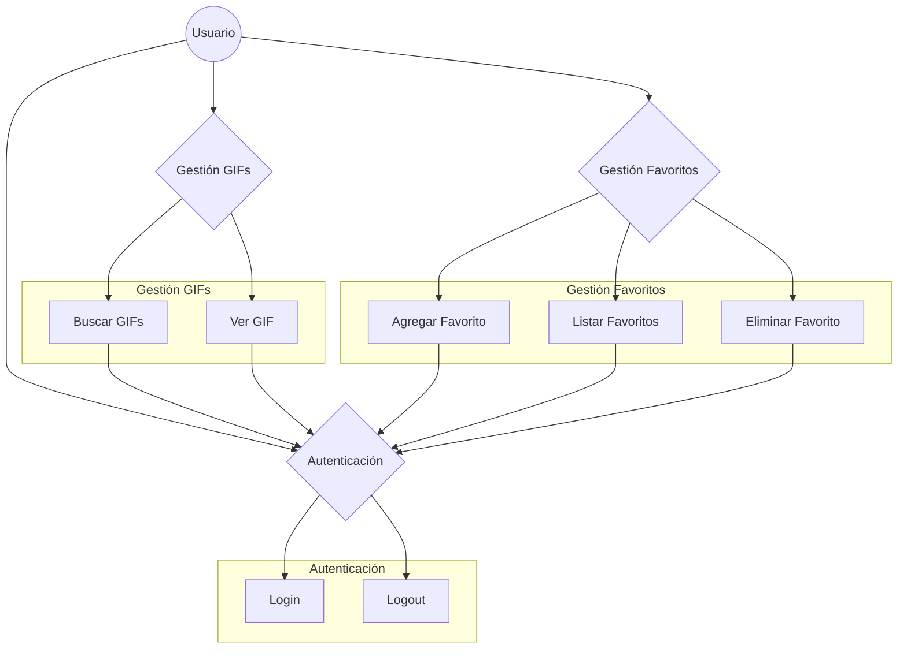
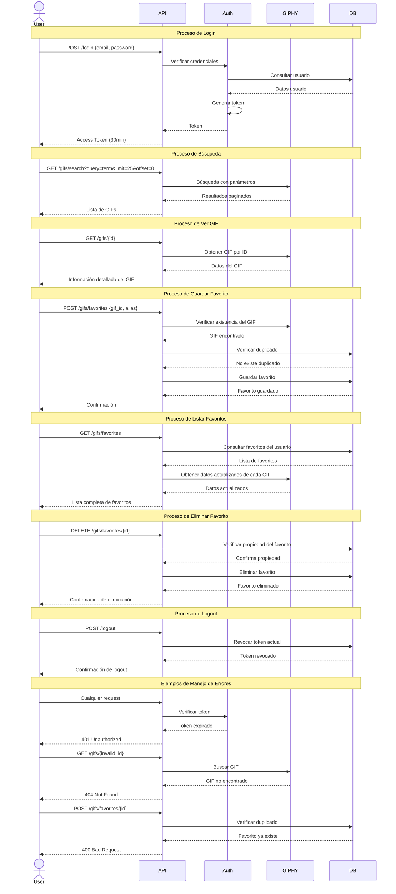

# GIPHY API Integration

API REST que integra con GIPHY API, provee funcionalidades de autenticación OAuth2.0 y manejo de GIFs favoritos.

## Casos de Uso

### Login
- **Actor**: Usuario
- **Descripción**: Permite autenticarse para usar la API
- **Flujo Principal**:
    1. Usuario envía email y password
    2. Sistema valida credenciales
    3. Sistema genera token con expiración de 30 minutos
    4. Sistema retorna token de acceso

### Buscar GIFs
- **Actor**: Usuario Autenticado
- **Descripción**: Busca GIFs por término o frase
- **Flujo Principal**:
    1. Usuario envía término de búsqueda
    2. Sistema consulta API de GIPHY
    3. Sistema retorna colección de resultados
- **Flujo Alternativo**:
    - Usuario puede especificar limit y offset para paginación

### Ver GIF
- **Actor**: Usuario Autenticado
- **Descripción**: Obtiene información detallada de un GIF
- **Flujo Principal**:
    1. Usuario envía ID del GIF
    2. Sistema consulta API de GIPHY
    3. Sistema retorna información detallada del GIF
- **Flujo Alternativo**:
    - Si el GIF no existe, sistema retorna error 404

### Guardar Favorito
- **Actor**: Usuario Autenticado
- **Descripción**: Almacena un GIF como favorito
- **Flujo Principal**:
    1. Usuario envía GIF_ID y alias
    2. Sistema verifica existencia del GIF en GIPHY
    3. Sistema almacena favorito
    4. Sistema retorna confirmación
- **Flujo Alternativo**:
    - Si el GIF no existe en GIPHY, retorna error
    - Si el favorito ya existe, retorna error

### Listar Favoritos
- **Actor**: Usuario Autenticado
- **Descripción**: Obtiene lista de favoritos del usuario
- **Flujo Principal**:
    1. Usuario solicita sus favoritos
    2. Sistema consulta base de datos
    3. Sistema retorna lista paginada de favoritos

### Eliminar Favorito
- **Actor**: Usuario Autenticado
- **Descripción**: Elimina un GIF de favoritos
- **Flujo Principal**:
    1. Usuario envía ID del favorito
    2. Sistema verifica propiedad
    3. Sistema elimina favorito
    4. Sistema retorna confirmación
- **Flujo Alternativo**:
    - Si el favorito no existe, retorna error
    - Si el favorito no pertenece al usuario, retorna error

### Logout
- **Actor**: Usuario Autenticado
- **Descripción**: Cierra sesión y revoca token
- **Flujo Principal**:
    1. Usuario solicita logout
    2. Sistema revoca token actual
    3. Sistema retorna confirmación

## Diagramas

### Diagrama de Casos de Uso

### Diagrama de Secuencia
[![](https://mermaid.ink/img/pako:eNqVVttOGzEQ_RVrJVArBZG29CUSVISENBIFxKVSpUjIXc8mhl17sb1pIeJj-g194zU_1vHeN-uENE8bz_F4zpmLvfB8ycDreRoeExA-DDidKhpNBMEf9Y1U5FaDyv7HVBnu85gKQ44vx47FxMzaq6Px5dcf7eVBfyKy1Z0dcqmkD1oSBuRMTnluOJcGiJxDFkRn0O-tAVrz3tERBoWIi-sbsh9aI1lARHnYwXO1_iUVe8ngiLNojLZHvoPiAfepIr4ChhpwGoLOcYhAoD33RAqdhAZhiU6o4jJDDPp7pacBNVI3zbmDzD4CAQodGPkAomYvAr-prWOAuGxp9cixj4x1ZibvPnUjLt67pesvXzXmkdFt5FsB1yUcDVHBKQ_0vgaq_NkXxKmnQwMq2g15xM3hx8-7Mgg0mMNuXdI01b3KNfGlsElf_onAKJnLmqJK2leQCstQu5hi0uyXQ4Uzrg21cY_Gp9pNH1NprduQb0Dd1Be8WS45t4ufxubR7iYxtsd44CKV1QKDsDqlwWYsAqki6vPlX4EwQ8OQMlptcNEbYWExrJ9TOpeKG7kNT_eedrukjIMMBJos8P8dZx1CQ061S4aqbeA3ZibtmybfpiBWLgRJYRQmuO7QRlx5Y0kc4gdr9pf1cC7zo1YxlZuCbdBgW_NRyECmKbLuoUwNdnrAi9ysGVG2FitR9VbTyrnHXXplIlYJVlOooJgVmWsmWZdl0wTNY50VzdKaxaGfYNaf04bEnb6tyzVJHbR2rG1cX0ZxCK1gXOoO7YgR_1noazbV9R0Mz4Y3w1WJW33erMdYyZjjJGOpzmsLqyiaCr_qsgzw7eKEDPp2dVriOXhTtcqpTMyWN2qJdF6ppbXidQVz6Re3Wl4LLWrZ3aVS6Ha0isNKQt-ogPss1UpJhUPqREbL1_UvheE9YMllRdza3OZ4gnE_Jhw9KPsW0mbTU2HjFY5jKubKzfOg-4HcCop7MNXPwCZi8xUk5thZ7M59FfUTbYPZMHGFdA7dWjgHVjpyKhPhjMV1O7zRMesneFngTzQf5c6QuqSP7XaVZcHreBE-Oyhn-EpdWPzEMzOIYOL18BOn_cPEm4gXxKGq8vpJ-F7PqAQ6npLJdOb1Ahpq_JfEON-K922--vIPW8uK9A?type=png)](https://mermaid.live/edit#pako:eNqVVttOGzEQ_RVrJVArBZG29CUSVISENBIFxKVSpUjIXc8mhl17sb1pIeJj-g194zU_1vHeN-uENE8bz_F4zpmLvfB8ycDreRoeExA-DDidKhpNBMEf9Y1U5FaDyv7HVBnu85gKQ44vx47FxMzaq6Px5dcf7eVBfyKy1Z0dcqmkD1oSBuRMTnluOJcGiJxDFkRn0O-tAVrz3tERBoWIi-sbsh9aI1lARHnYwXO1_iUVe8ngiLNojLZHvoPiAfepIr4ChhpwGoLOcYhAoD33RAqdhAZhiU6o4jJDDPp7pacBNVI3zbmDzD4CAQodGPkAomYvAr-prWOAuGxp9cixj4x1ZibvPnUjLt67pesvXzXmkdFt5FsB1yUcDVHBKQ_0vgaq_NkXxKmnQwMq2g15xM3hx8-7Mgg0mMNuXdI01b3KNfGlsElf_onAKJnLmqJK2leQCstQu5hi0uyXQ4Uzrg21cY_Gp9pNH1NprduQb0Dd1Be8WS45t4ufxubR7iYxtsd44CKV1QKDsDqlwWYsAqki6vPlX4EwQ8OQMlptcNEbYWExrJ9TOpeKG7kNT_eedrukjIMMBJos8P8dZx1CQ061S4aqbeA3ZibtmybfpiBWLgRJYRQmuO7QRlx5Y0kc4gdr9pf1cC7zo1YxlZuCbdBgW_NRyECmKbLuoUwNdnrAi9ysGVG2FitR9VbTyrnHXXplIlYJVlOooJgVmWsmWZdl0wTNY50VzdKaxaGfYNaf04bEnb6tyzVJHbR2rG1cX0ZxCK1gXOoO7YgR_1noazbV9R0Mz4Y3w1WJW33erMdYyZjjJGOpzmsLqyiaCr_qsgzw7eKEDPp2dVriOXhTtcqpTMyWN2qJdF6ppbXidQVz6Re3Wl4LLWrZ3aVS6Ha0isNKQt-ogPss1UpJhUPqREbL1_UvheE9YMllRdza3OZ4gnE_Jhw9KPsW0mbTU2HjFY5jKubKzfOg-4HcCop7MNXPwCZi8xUk5thZ7M59FfUTbYPZMHGFdA7dWjgHVjpyKhPhjMV1O7zRMesneFngTzQf5c6QuqSP7XaVZcHreBE-Oyhn-EpdWPzEMzOIYOL18BOn_cPEm4gXxKGq8vpJ-F7PqAQ6npLJdOb1Ahpq_JfEON-K922--vIPW8uK9A)

## ERD

[

